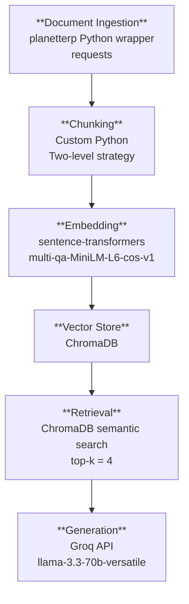

# Project 1 Planning: The Unofficial Guide

---

## Domain

Student reviews and grade distributions of Computer Science professors at the University of Maryland. A professor's grading style, workload, course content, and teaching quality change over time. Grade distributions shift. This system uses RAG over PlanetTerp's review and grade data to answer professor and course questions. It weighs recency. Old data is context, but newer data draws conclusions.

---

## Documents

| #   | Source     | Description                                                                                                   | URL or location                                                                                        |
| --- | ---------- | ------------------------------------------------------------------------------------------------------------- | ------------------------------------------------------------------------------------------------------ |
| 1   | PlanetTerp | Aaron Kyei-Asare — Reviews + grades. Courses: CMSC106, CMSC122, CMSC131                                       | [planetterp.com/professor/kyei-asare_aaron](https://planetterp.com/professor/kyei-asare_aaron)         |
| 2   | PlanetTerp | Anwar Mamat — Reviews + grades. Courses: CMSC132, CMSC216, CMSC330, CMSC430, CMSC433                          | [planetterp.com/professor/mamat](https://planetterp.com/professor/mamat)                               |
| 3   | PlanetTerp | Aravind Srinivasan — Reviews + grades. Courses: CMSC420, CMSC451, CMSC454                                     | [planetterp.com/professor/srinivasan](https://planetterp.com/professor/srinivasan)                     |
| 4   | PlanetTerp | Anna Evtushenko — Reviews + grades. Courses: CMSC420, DATA320, DATA602                                        | [planetterp.com/professor/evtushenko](https://planetterp.com/professor/evtushenko)                     |
| 5   | PlanetTerp | Christopher Kauffman — Reviews + grades. Courses: CMSC216, CMSC320, CMSC330, CMSC416                          | [planetterp.com/professor/kauffman_christopher](https://planetterp.com/professor/kauffman_christopher) |
| 6   | PlanetTerp | Cliff Bakalian — Reviews + grades. Courses: CMSC250, CMSC330                                                  | [planetterp.com/professor/bakalian](https://planetterp.com/professor/bakalian)                         |
| 7   | PlanetTerp | Clyde Kruskal — Reviews + grades. Courses: CMSC250, CMSC351, CMSC451, CMSC452, CMSC454                        | [planetterp.com/professor/kruskal](https://planetterp.com/professor/kruskal)                           |
| 8   | PlanetTerp | Daniel Abadi — Reviews + grades. Courses: CMSC424, CMSC624                                                    | [planetterp.com/professor/abadi_daniel](https://planetterp.com/professor/abadi_daniel)                 |
| 9   | PlanetTerp | Dave Levin — Reviews + grades. Courses: CMSC330, CMSC414, CMSC614                                             | [planetterp.com/professor/levin_dave](https://planetterp.com/professor/levin_dave)                     |
| 10  | PlanetTerp | David Van Horn — Reviews + grades. Courses: CMSC141, CMSC330, CMSC430, CMSC631                                | [planetterp.com/professor/van_horn](https://planetterp.com/professor/van_horn)                         |
| 11  | PlanetTerp | Elias Gonzalez — Reviews + grades. Courses: CMSC125, CMSC131, CMSC132, CMSC133, CMSC320                       | [planetterp.com/professor/gonzalez_elias](https://planetterp.com/professor/gonzalez_elias)             |
| 12  | PlanetTerp | Evan Golub — Reviews + grades. Courses: CMSC131, CMSC250, CMSC351, CMSC433, CMSC434                           | [planetterp.com/professor/golub](https://planetterp.com/professor/golub)                               |
| 13  | PlanetTerp | Herve Franceschi — Reviews + grades. Courses: CMSC132, CMSC216, CMSC351, CMSC424, CMSC436                     | [planetterp.com/professor/franceschi_herve](https://planetterp.com/professor/franceschi_herve)         |
| 14  | PlanetTerp | Ilchul Yoon — Reviews + grades. Courses: CMSC106, CMSC131, CMSC132, CMSC216, CMSC335, CMSC411                 | [planetterp.com/professor/yoon_ilchul](https://planetterp.com/professor/yoon_ilchul)                   |
| 15  | PlanetTerp | James Purtilo — Reviews + grades. Courses: CMSC132H, CMSC435                                                  | [planetterp.com/professor/purtilo](https://planetterp.com/professor/purtilo)                           |
| 16  | PlanetTerp | Jennifer Manly — Reviews + grades. Courses: CMSC115, CMSC122                                                  | [planetterp.com/professor/manly](https://planetterp.com/professor/manly)                               |
| 17  | PlanetTerp | John Aloimonos — Reviews + grades. Courses: CMSC426, CMSC477, CMSC733                                         | [planetterp.com/professor/aloimonos](https://planetterp.com/professor/aloimonos)                       |
| 18  | PlanetTerp | Justin Wyss-Gallifent — Reviews + grades. Courses: CMSC250, CMSC351, CMSC420, CMSC456                         | [planetterp.com/professor/wyss-gallifent](https://planetterp.com/professor/wyss-gallifent)             |
| 19  | PlanetTerp | Larry Herman — Reviews + grades. Courses: CMSC132, CMSC216, CMSC330                                           | [planetterp.com/professor/herman_larry](https://planetterp.com/professor/herman_larry)                 |
| 20  | PlanetTerp | Laxman Dhulipala — Reviews + grades. Courses: CMSC451, CMSC858N, CMSC858P                                     | [planetterp.com/professor/dhulipala_laxman](https://planetterp.com/professor/dhulipala_laxman)         |
| 21  | PlanetTerp | Leonidas Lampropoulos — Reviews + grades. Courses: CMSC430, CMSC433                                           | [planetterp.com/professor/lampropoulos](https://planetterp.com/professor/lampropoulos)                 |
| 22  | PlanetTerp | Marine Carpuat — Reviews + grades. Courses: CMSC421, CMSC422, CMSC470, CMSC723                                | [planetterp.com/professor/carpuat](https://planetterp.com/professor/carpuat)                           |
| 23  | PlanetTerp | Michael Marsh — Reviews + grades. Courses: CMSC414, CMSC417, CMSC420, CMSC433, CMSC436                        | [planetterp.com/professor/marsh_michael](https://planetterp.com/professor/marsh_michael)               |
| 24  | PlanetTerp | Michelle Mazurek — Reviews + grades. Courses: CMSC414, CMSC498G, CMSC634, CMSC732                             | [planetterp.com/professor/mazurek](https://planetterp.com/professor/mazurek)                           |
| 25  | PlanetTerp | Mihai Pop — Reviews + grades. Courses: CMSC131, CMSC423, CMSC424, CMSC701                                     | [planetterp.com/professor/pop](https://planetterp.com/professor/pop)                                   |
| 26  | PlanetTerp | Mohammad Hajiaghayi — Reviews + grades. Courses: CMSC351, CMSC420, CMSC474                                    | [planetterp.com/professor/hajiaghayi](https://planetterp.com/professor/hajiaghayi)                     |
| 27  | PlanetTerp | Mohammad Nayeem Teli — Reviews + grades. Courses: CMSC131, CMSC250, CMSC320, CMSC351, CMSC422, CMSC426        | [planetterp.com/professor/teli](https://planetterp.com/professor/teli)                                 |
| 28  | PlanetTerp | Nelson Padua-Perez — Reviews + grades. Courses: CMSC106, CMSC131, CMSC132, CMSC133, CMSC216, CMSC330, CMSC335 | [planetterp.com/professor/padua-perez](https://planetterp.com/professor/padua-perez)                   |
| 29  | PlanetTerp | Pedram Sadeghian — Reviews + grades. Courses: CMSC122, CMSC131, CMSC132, CMSC216                              | [planetterp.com/professor/sadeghian](https://planetterp.com/professor/sadeghian)                       |
| 30  | PlanetTerp | Robert Patro — Reviews + grades. Courses: CMSC423, CMSC701, CMSC858D                                          | [planetterp.com/professor/patro](https://planetterp.com/professor/patro)                               |
| 31  | PlanetTerp | Samrat Bhattacharjee — Reviews + grades. Courses: CMSC417, CMSC711                                            | [planetterp.com/professor/bhattacharjee](https://planetterp.com/professor/bhattacharjee)               |
| 32  | PlanetTerp | Stevens Miller — Reviews + grades. Courses: CMSC398C, CMSC425                                                 | [planetterp.com/professor/miller_stevens](https://planetterp.com/professor/miller_stevens)             |
| 33  | PlanetTerp | Sujeong Kim — Reviews + grades. Courses: CMSC421                                                              | [planetterp.com/professor/kim_sujeong](https://planetterp.com/professor/kim_sujeong)                   |
| 34  | PlanetTerp | Thomas Goldstein — Reviews + grades. Courses: CMSC473, CMSC664, CMSC673, CMSC764                              | [planetterp.com/professor/goldstein_thomas](https://planetterp.com/professor/goldstein_thomas)         |
| 35  | PlanetTerp | William Regli — Reviews + grades. Courses: CMSC421, CMSC422                                                   | [planetterp.com/professor/regli](https://planetterp.com/professor/regli)                               |
| 36  | PlanetTerp | Zhicheng Liu — Reviews + grades. Courses: CMSC471, CMSC734                                                    | [planetterp.com/professor/liu_zhicheng](https://planetterp.com/professor/liu_zhicheng)                 |

---

## Chunking Strategy

**Chunk size:** 200 tokens

**Overlap:** 50 tokens

**Reasoning:**

There are two document types: reviews and grade distributions. 

**Grade Distributions**

Grade distributions are structured into natural language (for embedding purposes) based on the API response structure.

For example, a grade distribution chunk might look like:

"CMSC417 taught by Samrat Bhattacharjee in Fall 2012:
3 A+, 2 A, 0 A-, 4 B+, 1 B, 0 B-, 2 C+, 6 C, 2 C-, 0 D+, 3 D, 0 D-,
8 F, 8 W"

whereas the API response structure is:

```json
{
  "course": "CMSC417",
  "professor": "Samrat Bhattacharjee",
  "semester": "201208",
  "section": "0101",
  "A+": 3,
  "A": 2,
  "A-": 0,
  "B+": 4,
  "B": 1,
  "B-": 0,
  "C+": 2,
  "C": 6,
  "C-": 2,
  "D+": 0,
  "D": 3,
  "D-": 0,
  "F": 8,
  "W": 8,
  "Other": 2
}
```

By design grade distribution chunks are consistently sized atomic units of meaning.

**Reviews**

Reviews lengths are wildly variable. Some are a few sentences, others are well-structured paragraphs, and some are long walls of text. The chunking strategy needs to be adaptive.

Reviews `<= 200` tokens will be one chunk. Reviews `> 200` tokens will be split into multiple chunks. With overlap of 50 tokens.

Paragraphs/sections in the API response are separated by `\r\n\r\n`. Split reviews into paragraphs. If a paragraph exceeds the chunk size of 200 tokens, split it into multiple chunks with overlap.

**Implementation note — mixed line endings (discovered during ingestion):** The API does not consistently use `\r\n\r\n`. At least two separator variants appear in the corpus:

- `\r\n\r\n` — double-CRLF blank line (documented, majority of reviews)
- `\n\r\n` — LF + CRLF blank line (undocumented variant, widespread)

Without normalization, reviews using `\n\r\n` were treated as single monolithic paragraphs. An Evan Golub review reached **1,442 tokens** as one unsplit block; a Clyde Kruskal review reached **771 tokens**. Splitting on the raw `\r\n\r\n` pattern missed these entirely.

Fix: normalize `\r\n` → `\n` (and bare `\r` → `\n`) before splitting on `\n\n`. This collapses both separator variants to a double-LF while leaving single `\r\n` line breaks (list items, line wraps within a paragraph) as single `\n` — correctly below the split threshold.

---

## Retrieval Approach

**Embedding model:** multi-qa-MiniLM-L6-cos-v1 via sentence-transformers

A model like all-MiniLM-L6-v2 was trained on symmetric similarity. This means it is designed to compare similar _sentences_, but not necessarily to compare a question to a relevant chunk of text as is the purpose of RAG. RAG is asymmetric. A short query matches to longer chunks of text. multi-qa-MiniLM-L6-cos-v1 was trained on question-answer pairs, so it is better suited for the RAG query-document asymmetry.

**Top-k:** 4

Too few retrieved chunks risks missing relevant context. Too many risks diluting the LLM response with irrelevant information or increasing hallucinations.

**Production tradeoff reflection:** multi-qa-MiniLM-L6-cos-v1 produces vectors with 384 dimensions. Other models may produce higher-dimensional vectors that capture more nuance, but they also increase storage with larger vectors and retrieval costs. In a production system with many documents, the cost of higher-dimensional vectors may outweigh the benefits.

---

## Evaluation Plan

| #   | Question                                                                                            | Expected answer                                                             |
| --- | --------------------------------------------------------------------------------------------------- | --------------------------------------------------------------------------- |
| 1   | What was the withdrawal rate in CMSC417 under Bhattacharjee in Fall 2012?                           | 20.5% (8 withdrawals out of 39 total students)                              |
| 2   | Did the A rate in CMSC417 under Bhattacharjee increase or decrease between Fall 2012 and Fall 2024? | Verifiable by directly comparing the two semester grade distribution chunks |
| 3   | Do students report that Bhattacharjee allows cheat sheets on exams?                                 | Yes — multiple reviews explicitly state he allows cheat sheet pages         |
| 4   | What do students say about when to start projects in CMSC417?                                       | Start early — stated explicitly and repeatedly across reviews               |
| 5   | What is the average GPA for computer science majors at UMD?                                         | System should decline to answer — this information is not in the corpus     |

---

## Anticipated Challenges

**Alias problem:** Student reviews or queries use nicknames/abbreviations/slang (e.g., "Bobby" for Bhattacharjee) while review/query/metadata uses formal names. The embedding model has no reason to relate these so a query using a nickname, for example, will miss chunks using the formal name.

**Cross-boundary context loss:** The two-level chunking strategy splits long reviews at paragraph breaks. Statements/ideas that span two paragraphs (e.g., "compared to CMSC416, this class is much harder... Bobby's exams are curved") will produce two chunks that lose their relationship to each other.

---

## Architecture



---

## AI Tool Plan

**Milestone 3 — Ingestion and chunking:**
Input to Claude: Documents section (professor list + URLs), file naming convention, and Chunking Strategy section (two-level logic, thresholds, delimiter). Ask it to implement `fetch_professor_reviews()`, `fetch_professor_grades()`, and `chunk_document()`. Verify by running `chunk_document()` on a reviews document with a long review (confirms paragraph splitting and token-level overlap) and a short review (confirms atomic preservation), and on a grades document (confirms NL string construction and multi-section aggregation).

**Milestone 4 — Embedding and retrieval:**
Input to Claude: Retrieval Approach section (model, top-k), Vector DB Architecture section (NL string construction, metadata fields), pipeline diagram. Ask it to implement `embed_and_store()` and `retrieve()`. Verify by running all 5 evaluation questions as retrieval-only queries and confirming distance scores below 0.5 and visibly relevant chunks.

**Milestone 5 — Generation and interface:**
Input to Claude: Retrieval Approach section, grounding and attribution requirements, Gradio skeleton from spec. Ask it to implement `generate()` and the Gradio interface. Verify by running the out-of-scope question (Q5) and confirming refusal, and the grade distribution question (Q1) and confirming the answer traces to a specific retrieved chunk.
